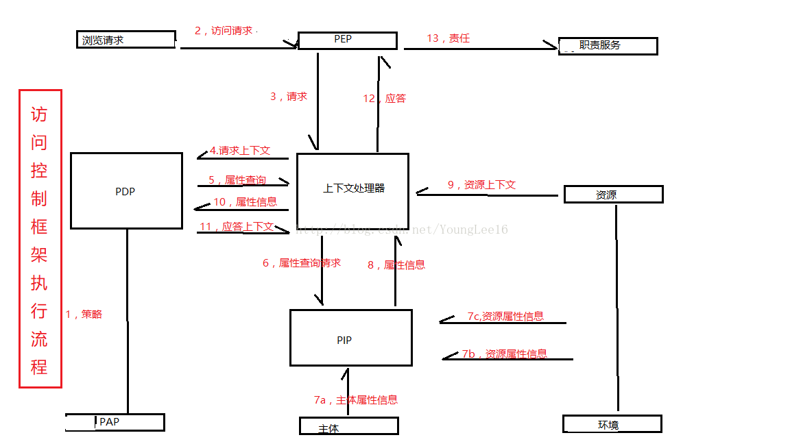
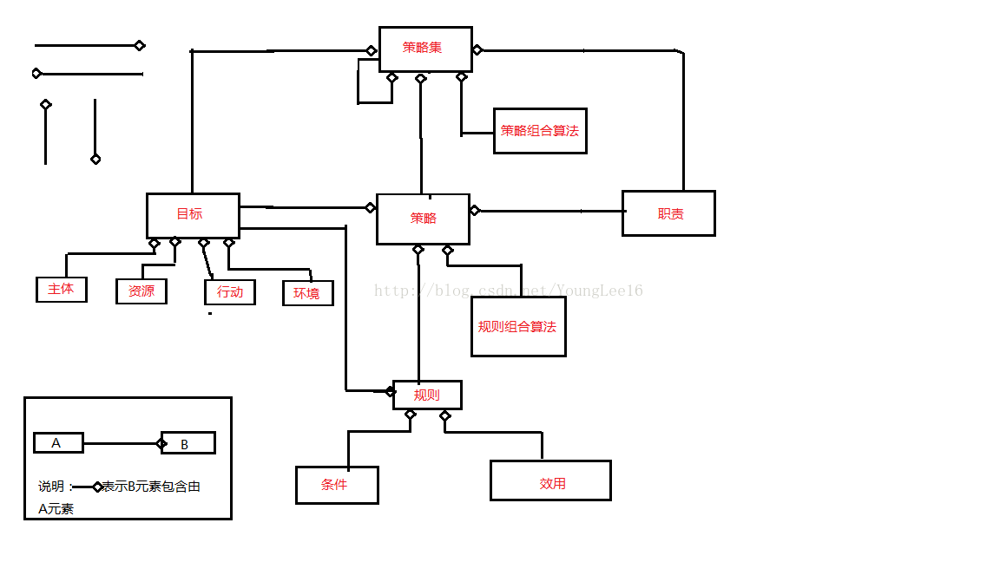

## XACML (eXtensible Access Control Markup Language)

Ref: http://www.360doc.com/content/16/0801/11/13819_579968681.shtml  
Ref: https://blog.csdn.net/YoungLee16/article/details/78058938

XACML是一种用于决定请求/响应的通过访问控制策略语言和执行授权策略的框架，它在传统的分布式环境中被广泛用于访问控制策略的执行。在典型的访问控制框架中，有策略执行点PEP(Policy Enforcement Point)和策略决定点PDP(Policy Decision Point)。PEP用于表达请求和执行访问控制决定。PDP从PEP处接收请求，评估适用于该请求的策略，并将授权决定返回给PEP。

XACML是一种基于XML的开放标准语言，它设计用于描述安全策略以及对网络服务、数字版权管理(DRM)以及企业安全应用细粒度进行访问的权限。

### 基本概念

**主体**(Subject)：主体即请求对某种资源执行某些动作的请求者。

**资源**(Resource)：资源即是系统提供给请求者使用的数据，服务和系统组件。

**策略**(policy)：策略是一组规则，规定主体对资源使用的一些要求，多个策略进行组合形成策略集(Policy Set)。

**策略执行点**(Policy Enforcement Point, PEP)：是在一个具体的应用环境下执行访问控制的实体，将具体应用环境下访问控制请求转换为适应XACML要求的策略请求。然后根据决策请求的判决结果执行相应的动作，如允许用户请求和拒绝用户请求等。

**策略决策点**(Policy Decision Point, PDP)：是系统中授权的实体，依据XACML描述的访问控制策略以及其他属性信息进行访问控制决策。

**策略管理点**(Policy Administration Point, PAP)：是在系统中产生和维护安全策略的实体。

**策略信息点**(Policy Information Point, PIP)：通过它可以获取主体、资源和环境的属性信息的实体。

### 访问控制框架流程图

访问控制的框架执行基本流程：

1. 策略管理点（PAP）产生需要的安全策略，这些策略使用XACML语言描述，是访问控制决策的基础。

2. 在一个具体的应用程序环境下，策略执行点（PEP）截获用户发送的访问控制请求，这个访问控制请求的内容和格式根据不同的应用程序而不同。

3. 策略执行点将截获的访问控制请求发送给上下文处理器，由上下文处理器把请求统一成XACML格式的访问控制请求。

4. 上下文处理器将产生的XACML格式的访问控制请求发送给访问控制决策点（PDP），请求PDP进行访问控制决策。

5. PDP在处理访问控制决策的时候可能需要其他的一些条件，如主体的属性、资源的属性及环境的属性，PDP将这些额外条件请求发送给上下文处理器。

6. 上下文处理器将依据属性请求的类型，向策略信息点（PIP）发送属性请求。

7. PIP根据请求向不同的实体请求不同的属性信息，包括主体的属性信息、环境的属性信息及资源的属性信息，并将得到的信息返回给上下文处理器。

8. 上下文处理器将属性信息和资源的上下文（资源的上下文信息可选）发送给PDP。

9. PDP根据策略信息、属性信息，以及资源的上下文信息进行访问控制决策，并将决策结果返回给上下文处理器。上下文处理器将决策结果返回PEP，以执行相应的决策结果。

10. 在返回的决策结果中可能是拒绝，也可能是许可，还可能带上有相应的职责信息，如需要进行日志记录等。

### XACML策略语言模型

### 组合算法

XACML策略语言是一种分布式策略语言，对于同一资源可能由不同的策略管理点（PAP）为其指定不同的策略。这些策略之间有可能存在冲突，如有的规则可能允许访问，有的规则可能不允许，这些冲突必须得到解决。也可能多条策略的执行效用一样，这样的策略只要执行一条即可得到相应的策略通用。通过XACML策略语言模型可以看出，一条策略可能包含多条规则，这些策略同样有可能存在冲突或具有相同的效用。

因此在XACML语言中需要一个组合算法来解决冲突，并且避免不必要的运算。在XACML语言中，规定了4种类型的组合算法，即拒绝优先算法（Deny-overrides）、许可优先算法（permit-overrides）、首先应用算法（First-applicable）和唯一应用算法（only-one-applicable）。在这些算法种，除了唯一应用算法只适用于策略组合外，其他适用于规则组合算法和策略组合算法。

### 规则(Rule)

规则包括三个组成部分，即目标（Target）、效用（Effect）和条件（Condition）。

**目标**（Target）表示规则应用的对象，其中包括4个基本元素，即资源（Resource）、主体（Subject）、动作（Actions）和环境（Enviroment）。一个目标的基本含义是主体对资源执行的某些动作，这些动作是在一定的环境下执行的。在应用规则的时候，根据请求的主体、资源、动作，以及相关的环境因素来查找可以应用的规则。

**效用**（Effect）表示规则应用后的结果，包括两个值，即许可（Permit）和拒绝（Deny）。效用的含义是如果某一个决策请求中的要素（包括主体、资源、动作和环境）和规则中的目标相同，并且效用是许可，则决策结果是许可；如果效用是拒绝，则决策结果是拒绝。

同一规则可能有不同的应用环境，这样在决策时还需要一些辅助的额外信息，这些额外信息需要**条件**（Condition）来描述。条件是一些谓词结构，其结果是True或者False，通过这些条件可以描述主体、动作、资源，以及环境的一些属性和上下文信息（如操作的时间限制要求）。

**安全和隐私方面的考虑**

1. 威胁模型
2. 安全保障措施 
